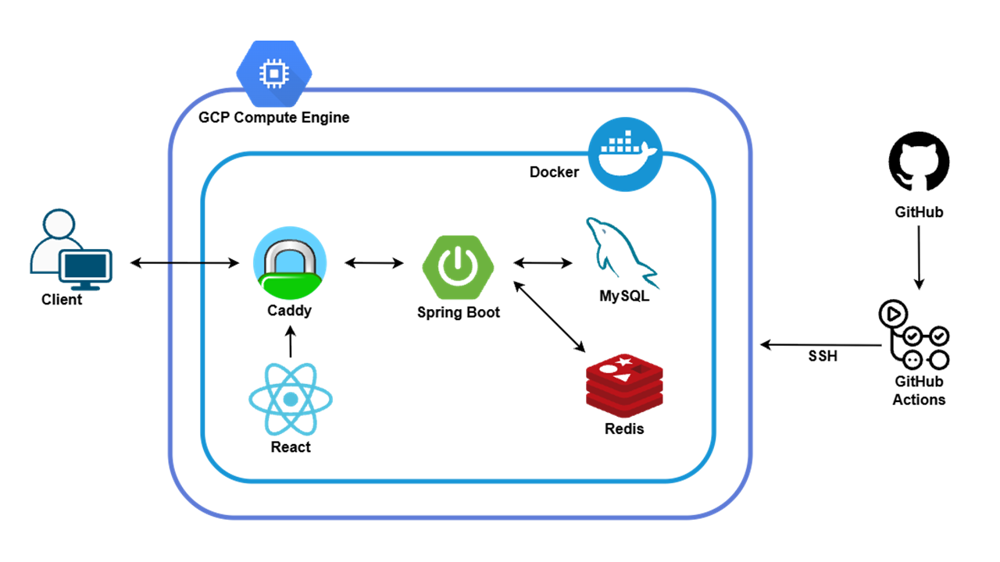
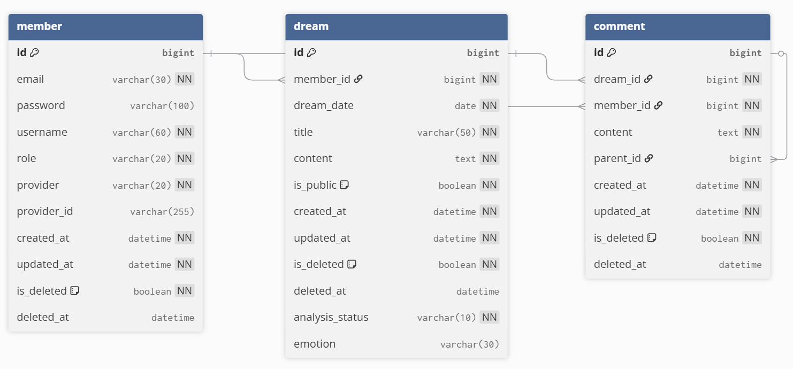

# :crescent_moon: [Somniverse](https://somniverse.kro.kr)

> 꿈도 나누면 배가 됩니다!

---
 

# 1.  :full_moon_face:서비스 소개

* Somniverse는 꿈 기록 및 공유 서비스입니다.

---
 

# 2. :computer: 핵심 기능

- 꿈일기를 작성할 수 있습니다.
    - 제목, 내용, 꿈 일자, 공개 여부를 입력합니다.
    - Gemini 기반 꿈일기 감정 분석을 제공합니다.
- 꿈일기에 댓글을 작성할 수 있습니다.
    - 댓글에 대댓글을 작성할 수 있습니다.
- 내가 작성한 꿈일기를 모아서 관리할 수 있습니다.
- 소셜 로그인을 지원합니다.
- 관리자 기능을 지원합니다.

---
 

# 3. :wrench: 기술 스택(백엔드)

* Spring Boot
* Spring Data JPA
* Spring Security
* Docker
* MySQL
* Redis
* GCP Compute Engine
* GitHub Actions
* Caddy

---
 

# 4. :classical_building: 프로젝트 구조

  

---
 

# 5. :floppy_disk: ERD

  

